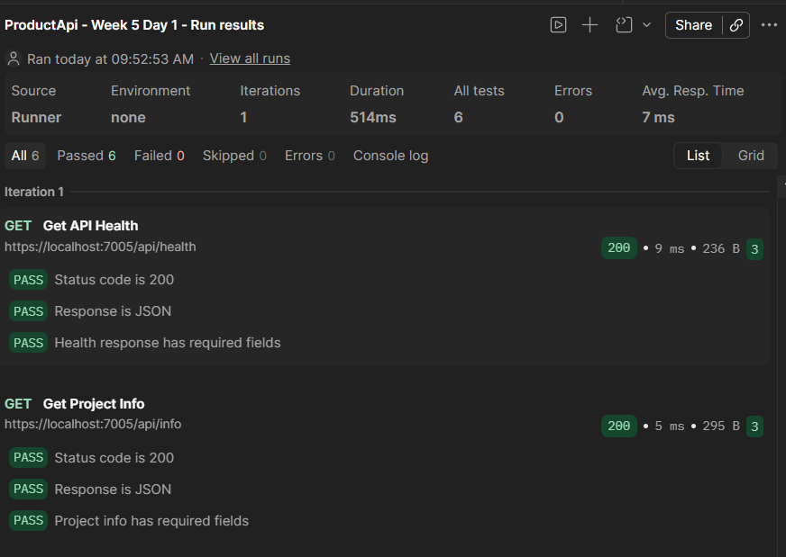
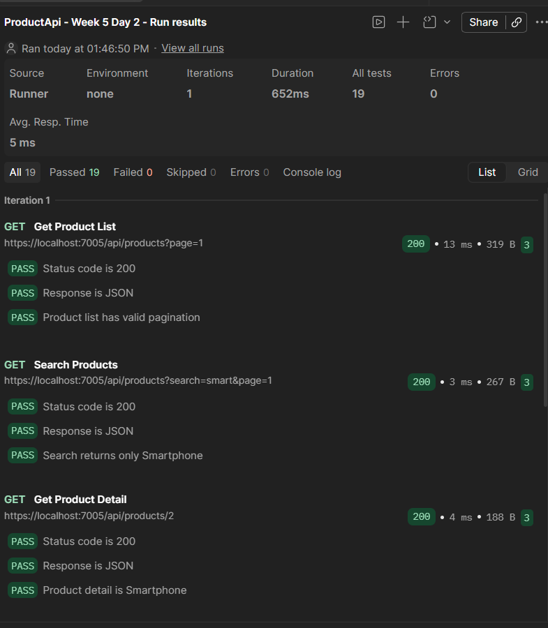
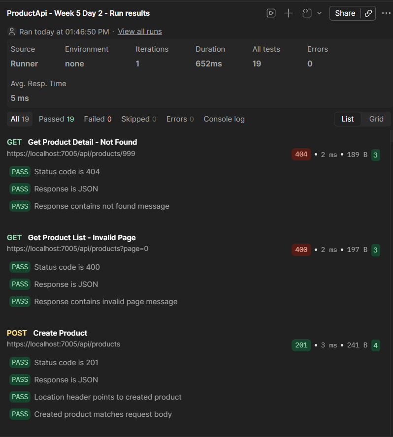
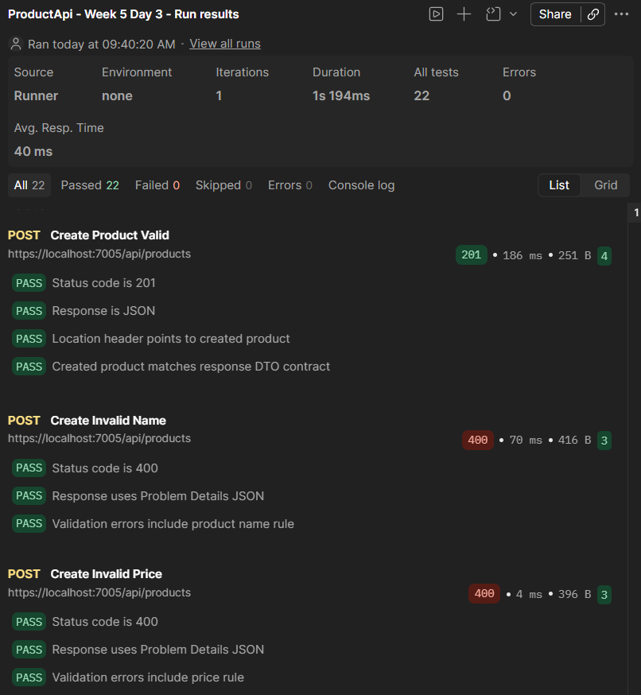
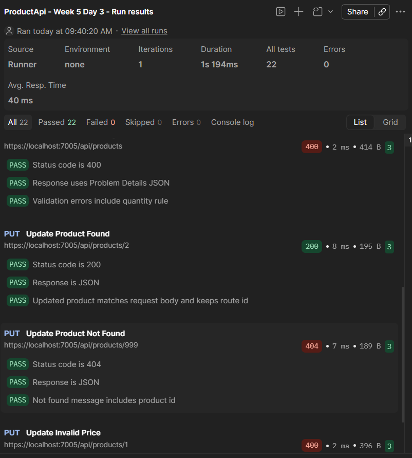
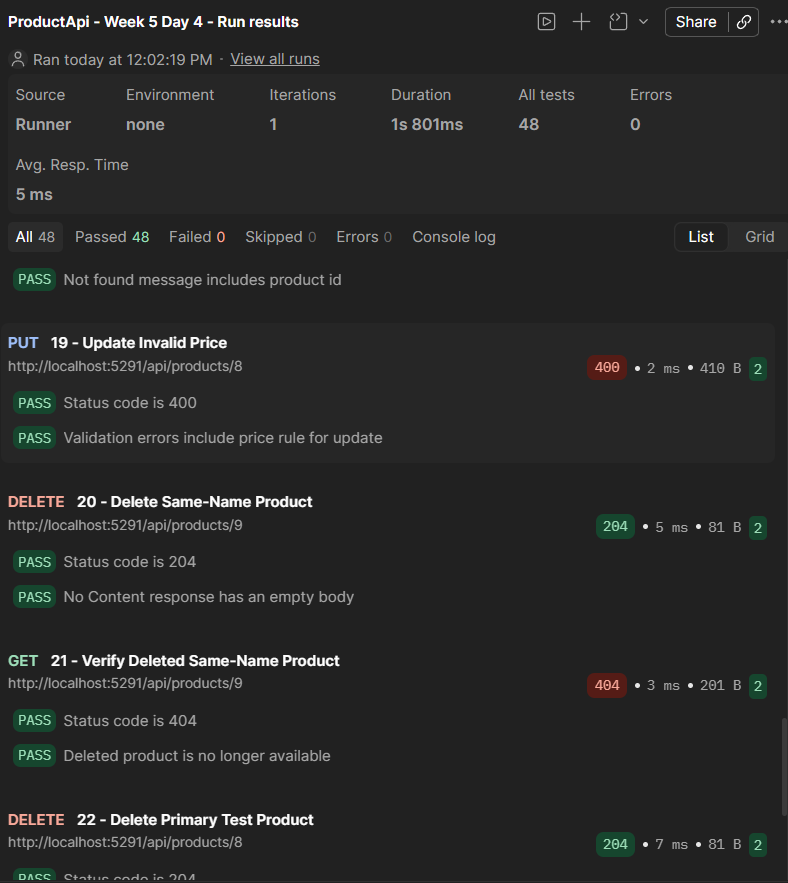
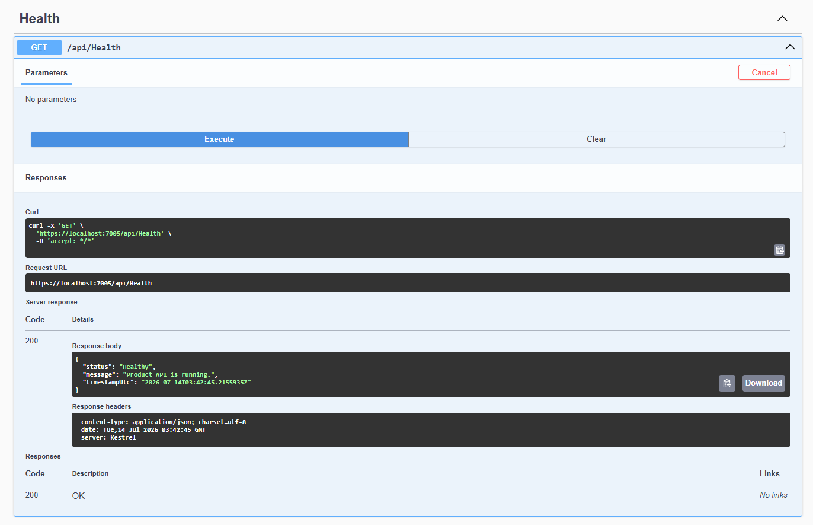

# ProductApi

Dự án thực hành **ASP.NET Core Web API** trong lộ trình .NET tuần 5.

Mục tiêu của dự án là xây dựng Product API theo từng ngày, bắt đầu từ kiến thức HTTP, REST API, Controller và Swagger, sau đó phát triển thành API CRUD có DTO, Service, Repository và Entity Framework Core.

## Mục tiêu Day 1

- Hiểu request và response trong HTTP.
- Hiểu các HTTP method cơ bản: GET, POST, PUT và DELETE.
- Hiểu các status code phổ biến: 200, 201, 400, 401, 404 và 500.
- Tạo project ASP.NET Core Web API bằng .NET 8 LTS.
- Cấu hình Swagger/OpenAPI.
- Tạo endpoint kiểm tra trạng thái API: `GET /api/health`.
- Hoàn thành mini challenge: `GET /api/info`.
- Test API bằng Swagger, file `.http` và Postman.

## Mục tiêu Day 2

- Biết tạo Controller và route đúng chuẩn.
- Biết nhận dữ liệu qua query, path và request body.
- Biết trả `ActionResult` phù hợp với từng tình huống.
- Tạo mock Product API với endpoint danh sách, chi tiết và tạo mới.
- Kiểm thử các response `200`, `201`, `400` và `404` bằng Swagger, file `.http` và Postman.

## Mục tiêu Day 3

- Tách API contract khỏi model nội bộ bằng DTO.
- Tạo `ProductCreateDto`, `ProductUpdateDto` và `ProductResponseDto`.
- Validation request bằng DataAnnotations với message rõ ràng.
- Mapping thủ công giữa DTO và `Product` model.
- Refactor GET và POST để không expose model nội bộ trực tiếp.
- Tạo `PUT /api/products/{id}` và xử lý `200`, `400`, `404`.
- Kiểm thử DTO, validation và mapping bằng Swagger, file `.http` và Postman.

## Mục tiêu Day 4

- Thay dữ liệu mock bằng PostgreSQL và Entity Framework Core.
- Tạo `AppDbContext`, `DbSet<Product>` và migration đầu tiên.
- Tách truy cập dữ liệu vào Repository và nghiệp vụ/mapping vào Service.
- Đăng ký DbContext, Repository và Service bằng Dependency Injection.
- Chuyển Product API sang các thao tác database bất đồng bộ với `async`/`await`.
- Hoàn thiện CRUD với `DELETE /api/products/{id}`.
- Hoàn thành mini challenge: không cho phép trùng tên Product trong cùng category, không phân biệt chữ hoa/thường.
- Kiểm thử CRUD thật, validation, duplicate rule và persistence sau khi restart API.

## Mục tiêu Day 5

- Hoàn thiện và review Product API CRUD theo chuẩn REST.
- Review DTO, validation, Dependency Injection và luồng Controller-Service-Repository.
- Kiểm tra các lỗi phổ biến: trả Entity trực tiếp, truy cập DbContext trong Controller, DI lifetime sai và blocking async.
- Tạo Postman collection CRUD có dữ liệu động, assertions và tự dọn dữ liệu test.
- Viết tài liệu API endpoint và checklist review Pull Request.
- Chuẩn bị kịch bản demo từng endpoint trong khoảng 5 phút.

## Công nghệ sử dụng

- .NET 8 LTS
- ASP.NET Core Web API
- C#
- Entity Framework Core 8
- Npgsql Entity Framework Core Provider
- PostgreSQL và pgAdmin 4
- .NET User Secrets
- Swashbuckle.AspNetCore
- Swagger/OpenAPI
- Postman và Newman
- Git và GitHub

## Yêu cầu môi trường

Cài đặt các công cụ sau trước khi chạy dự án:

- .NET SDK 8.x (khuyến nghị để build và chạy đúng môi trường LTS của dự án)
- PostgreSQL local server và pgAdmin 4
- EF Core CLI (`dotnet-ef`) phiên bản 8.x
- Git
- Postman (để import và chạy collection kiểm thử)
- Visual Studio 2022, JetBrains Rider hoặc Visual Studio Code

Kiểm tra phiên bản .NET SDK:

```powershell
dotnet --version
```

Dự án target `net8.0` và không khóa một patch SDK cụ thể bằng `global.json`, giúp hạn chế lỗi khi máy khác không có đúng một phiên bản SDK cố định.

## Cấu trúc dự án

```text
ProductApi/
├── docs/
│   ├── day05-demo-script.md
│   ├── day05-pr-review-checklist.md
│   └── images/
│       ├── day01-health-endpoint.png
│       ├── day01-postman-runner.png
│       ├── day02-postman-runner-part1.png
│       ├── day02-postman-runner-part2.png
│       ├── day03-postman-runner-part1.png
│       ├── day03-postman-runner-part2.png
│       └── day04-postman-runner.png
├── postman/
│   ├── ProductApi-Week5-Day1.postman_collection.json
│   ├── ProductApi-Week5-Day2.postman_collection.json
│   ├── ProductApi-Week5-Day3.postman_collection.json
│   ├── ProductApi-Week5-Day4.postman_collection.json
│   └── ProductApi-Week5-Day5.postman_collection.json
├── src/
│   └── ProductApi/
│       ├── Controllers/
│       │   ├── HealthController.cs
│       │   ├── InfoController.cs
│       │   └── ProductsController.cs
│       ├── Data/
│       │   ├── Migrations/
│       │   │   ├── 20260716043422_InitialCreate.cs
│       │   │   ├── 20260716043422_InitialCreate.Designer.cs
│       │   │   └── AppDbContextModelSnapshot.cs
│       │   └── AppDbContext.cs
│       ├── Dtos/
│       │   ├── ProductCreateDto.cs
│       │   ├── ProductListResponseDto.cs
│       │   ├── ProductResponseDto.cs
│       │   └── ProductUpdateDto.cs
│       ├── Models/
│       │   └── Product.cs
│       ├── Repositories/
│       │   ├── IProductRepository.cs
│       │   └── ProductRepository.cs
│       ├── Services/
│       │   ├── IProductService.cs
│       │   ├── ProductService.cs
│       │   └── ProductWriteResult.cs
│       ├── Properties/
│       │   └── launchSettings.json
│       ├── appsettings.Development.json
│       ├── appsettings.json
│       ├── ProductApi.csproj
│       ├── ProductApi.http
│       └── Program.cs
├── .gitignore
├── ProductApi.sln
└── README.md
```

## Cài đặt và chạy dự án

### 1. Clone repository

```powershell
git clone https://github.com/TINVO04/ProductApi.git
cd ProductApi
```

### 2. Restore dependency

```powershell
dotnet restore .\ProductApi.sln
```

`restore` tải các package mà project khai báo trong file project.

### 3. Build solution

```powershell
dotnet build .\ProductApi.sln
```

Kết quả đạt chuẩn:

```text
Build succeeded.
0 Warning(s)
0 Error(s)
```

### 4. Cấu hình PostgreSQL và User Secrets

Tạo database `ProductApiDb` trên PostgreSQL local. Sau đó khởi tạo và lưu connection string ở User Secrets để không đưa mật khẩu vào repository:

```powershell
dotnet user-secrets init --project .\src\ProductApi\ProductApi.csproj
dotnet user-secrets set "ConnectionStrings:DefaultConnection" "Host=localhost;Port=5432;Database=ProductApiDb;Username=postgres;Password=<local-password>" --project .\src\ProductApi\ProductApi.csproj
```

Giá trị `<local-password>` phải được thay bằng mật khẩu PostgreSQL trên máy chạy và không được commit vào Git.

### 5. Cập nhật database bằng migration

```powershell
dotnet ef database update --project .\src\ProductApi\ProductApi.csproj
```

Kiểm tra migration và model:

```powershell
dotnet ef migrations list --project .\src\ProductApi\ProductApi.csproj
dotnet ef migrations has-pending-model-changes --project .\src\ProductApi\ProductApi.csproj
```

Migration đầu tiên tạo extension `citext`, bảng `Products`, ba bản ghi seed, identity bắt đầu từ `4` và unique index trên cặp `(Name, CategoryId)`.

### 6. Tin cậy HTTPS development certificate

Chỉ cần thực hiện khi máy chưa tin cậy chứng chỉ HTTPS local:

```powershell
dotnet dev-certs https --trust
```

### 7. Chạy API

Chạy profile HTTP dùng cho file HTTP và Postman Day 4-5:

```powershell
dotnet run --project .\src\ProductApi\ProductApi.csproj --launch-profile http
```

Hoặc chạy profile HTTPS:

```powershell
dotnet run --project .\src\ProductApi\ProductApi.csproj --launch-profile https
```

API chạy tại:

```text
https://localhost:7005
http://localhost:5291
```

## Swagger

Mở Swagger UI tại:

```text
https://localhost:7005/swagger
```

Swagger UI dùng để xem tài liệu API và gửi request thử trực tiếp bằng nút **Try it out** và **Execute**.

OpenAPI JSON được sinh tại:

```text
https://localhost:7005/swagger/v1/swagger.json
```

## API endpoints Day 1

| Method | Endpoint        | Mô tả                                                       | Status thành công |
| ------ | --------------- | ------------------------------------------------------------- | ------------------- |
| GET    | `/api/health` | Kiểm tra API có đang hoạt động hay không               | `200 OK`          |
| GET    | `/api/info`   | Trả thông tin cơ bản của project và môi trường chạy | `200 OK`          |

## API endpoints Day 2

| Method | Endpoint | Mô tả | Status thành công |
| ------ | -------- | ----- | ----------------- |
| GET | `/api/products?page=1` | Lấy danh sách Product có phân trang | `200 OK` |
| GET | `/api/products?search=smart&page=1` | Tìm Product theo tên và phân trang | `200 OK` |
| GET | `/api/products/{id}` | Lấy Product theo ID | `200 OK` hoặc `404 Not Found` |
| POST | `/api/products` | Tạo Product mới từ request body | `201 Created` hoặc `400 Bad Request` |

## API endpoints Day 3

| Method | Endpoint | Request contract | Response contract | Status |
| ------ | -------- | ---------------- | ----------------- | ------ |
| GET | `/api/products` | Query `search`, `page` | Danh sách `ProductResponseDto` và pagination | `200`, `400` |
| GET | `/api/products/{id}` | Route `id` | `ProductResponseDto` | `200`, `404` |
| POST | `/api/products` | `ProductCreateDto` | `ProductResponseDto` | `201`, `400` |
| PUT | `/api/products/{id}` | Route `id` và `ProductUpdateDto` | `ProductResponseDto` | `200`, `400`, `404` |

Request DTO không chứa `Id`; server chịu trách nhiệm sinh ID khi tạo mới và lấy ID từ route khi cập nhật. Response DTO chứa `Id` để client nhận diện tài nguyên.

## API endpoints Day 4

| Method | Endpoint | Chức năng | Status |
| ------ | -------- | --------- | ------ |
| GET | `/api/products?search={text}&page={number}` | Truy vấn PostgreSQL, tìm kiếm không phân biệt hoa/thường và phân trang | `200`, `400` |
| GET | `/api/products/{id}` | Lấy Product theo ID từ PostgreSQL | `200`, `404` |
| POST | `/api/products` | Tạo Product có `CategoryId` | `201`, `400`, `409` |
| PUT | `/api/products/{id}` | Cập nhật toàn bộ dữ liệu Product | `200`, `400`, `404`, `409` |
| DELETE | `/api/products/{id}` | Xóa Product khỏi PostgreSQL | `204`, `404` |

Luồng xử lý được tách thành các lớp:

1. `ProductsController` nhận HTTP request, gọi Service và ánh xạ kết quả nghiệp vụ sang HTTP status.
2. `ProductService` chuẩn hóa tên, mapping DTO, tạo pagination và kiểm tra quy tắc duplicate.
3. `ProductRepository` thực hiện truy vấn và lưu dữ liệu bất đồng bộ qua EF Core.
4. `AppDbContext` cấu hình PostgreSQL schema, seed data và unique index.

Mini challenge được bảo vệ ở cả Service và database. Tên Product được chuẩn hóa khoảng trắng; cột `Name` dùng kiểu PostgreSQL `citext`; unique index `(Name, CategoryId)` ngăn trùng tên không phân biệt hoa/thường trong cùng category. Cùng một tên vẫn được phép tồn tại ở category khác.

## API endpoints Day 5

Day 5 giữ nguyên contract Product API đã hoàn thiện ở Day 4 và tập trung review tính đúng chuẩn REST, phân lớp, DTO, DI, async EF Core và khả năng demo đầy đủ CRUD.

| Method | Endpoint | Chức năng | Status chính |
| ------ | -------- | --------- | ------------ |
| GET | `/api/products?search={text}&page={number}` | Lấy danh sách, tìm kiếm và phân trang | `200`, `400` |
| GET | `/api/products/{id}` | Lấy Product theo ID | `200`, `404` |
| POST | `/api/products` | Tạo Product và trả location của tài nguyên mới | `201`, `400`, `409` |
| PUT | `/api/products/{id}` | Cập nhật toàn bộ Product | `200`, `400`, `404`, `409` |
| DELETE | `/api/products/{id}` | Xóa Product | `204`, `404` |

Kết quả review source:

- Controller chỉ phụ thuộc `IProductService`, không truy cập trực tiếp Repository hoặc DbContext.
- Request/response sử dụng DTO; Controller không trả trực tiếp `Product` entity.
- Service chịu trách nhiệm business rule, chuẩn hóa dữ liệu và mapping DTO.
- Repository dùng EF Core async, `AsNoTracking`, query database và phân trang trước khi materialize.
- DbContext, Repository và Service được đăng ký với lifetime phù hợp qua Dependency Injection.
- Không phát hiện `async void`, `.Result`, `.Wait()` hoặc `Task.Run()` bọc database I/O.

### GET `/api/health`

Response mẫu:

```json
{
  "status": "Healthy",
  "message": "Product API is running.",
  "timestampUtc": "2026-07-14T03:42:45.2155935Z"
}
```

Ý nghĩa:

- `status`: trạng thái hiện tại của API.
- `message`: thông báo mô tả ngắn.
- `timestampUtc`: thời điểm server xử lý request theo múi giờ UTC.

### GET `/api/info`

Response mẫu:

```json
{
  "projectName": "ProductApi",
  "version": "1.0.0",
  "framework": ".NET 8.x",
  "environment": "Development",
  "description": "ASP.NET Core Web API for product management."
}
```

Giá trị `framework` được đọc từ runtime thực tế thay vì ghi cứng trong source code.

## Test bằng file HTTP

File `src/ProductApi/ProductApi.http` chứa request mẫu cho Day 1 đến Day 4 và sử dụng `http://localhost:5291`:

- `GET /api/health` và `GET /api/info`.
- GET danh sách hai trang, tìm kiếm không phân biệt hoa/thường, chi tiết `200`/`404` và page không hợp lệ `400`.
- POST tạo sản phẩm hợp lệ với `201 Created`.
- POST kiểm tra name, category, price và quantity không hợp lệ với `400 Bad Request`.
- POST kiểm tra trùng tên trong cùng category với `409 Conflict` và cùng tên ở category khác với `201 Created`.
- PUT cập nhật thành công, duplicate `409`, ID không tồn tại `404` và validation `400`.
- DELETE Product tồn tại với `204 No Content` và ID không tồn tại với `404 Not Found`.

Có thể gửi từng request trực tiếp trong IDE hỗ trợ file `.http`. Các request Day 4 đã được đối chiếu với CRUD PostgreSQL thật.

## Test Day 1 bằng Postman

Collection kiểm thử được lưu tại `postman/ProductApi-Week5-Day1.postman_collection.json` theo schema Postman Collection v2.1.

Cách chạy collection:

1. Khởi động API bằng HTTPS tại `https://localhost:7005`.
2. Mở Postman và chọn **Import**.
3. Import file `postman/ProductApi-Week5-Day1.postman_collection.json`.
4. Mở collection **ProductApi - Week 5 Day 1** và chọn **Run**.
5. Chạy toàn bộ hai request trong Collection Runner.

Collection sử dụng biến dùng chung `baseUrl` với giá trị mặc định `https://localhost:7005` và kiểm tra:

- HTTP status code là `200`.
- Response có content type JSON.
- Response chứa các trường bắt buộc của từng endpoint.

Kết quả Collection Runner: `2` request, `6` test passed, `0` failed và `0` error.



## Test Day 2 bằng Postman

Collection kiểm thử Day 2 được lưu tại `postman/ProductApi-Week5-Day2.postman_collection.json` theo schema Postman Collection v2.1.

Collection gồm 6 request:

1. `GET /api/products?page=1` — danh sách và phân trang.
2. `GET /api/products?search=smart&page=1` — tìm kiếm theo tên.
3. `GET /api/products/2` — lấy chi tiết sản phẩm tồn tại.
4. `GET /api/products/999` — kiểm tra `404 Not Found`.
5. `GET /api/products?page=0` — kiểm tra `400 Bad Request`.
6. `POST /api/products` — tạo sản phẩm và kiểm tra `201 Created`.

Collection sử dụng biến dùng chung `baseUrl` với giá trị `https://localhost:7005`. Collection Runner đã chạy 1 iteration với kết quả `19` test passed, `0` failed, `0` skipped và `0` error.





## Test Day 3 bằng Postman

Collection kiểm thử Day 3 được lưu tại `postman/ProductApi-Week5-Day3.postman_collection.json` theo schema Postman Collection v2.1 và sử dụng biến `baseUrl` với giá trị `https://localhost:7005`.

Collection gồm 7 request:

1. POST tạo Product hợp lệ, kiểm tra `201`, `Location` và response DTO.
2. POST với name quá ngắn, kiểm tra validation `400`.
3. POST với price bằng `0`, kiểm tra validation `400`.
4. POST với quantity âm, kiểm tra validation `400`.
5. PUT cập nhật Product tồn tại, kiểm tra `200` và dữ liệu sau mapping.
6. PUT cập nhật ID không tồn tại, kiểm tra `404`.
7. PUT với price âm, kiểm tra validation `400`.

Validation errors của ASP.NET Core sử dụng media type `application/problem+json` theo chuẩn Problem Details; các response thành công và response `404` tùy chỉnh sử dụng `application/json`.

Collection Runner đã chạy 1 iteration với kết quả `22/22` test passed, `0` failed, `0` skipped và `0` error.





## Test Day 4 bằng Postman

Collection Day 4 được lưu tại `postman/ProductApi-Week5-Day4.postman_collection.json`, theo schema Postman Collection v2.1 và sử dụng `baseUrl=http://localhost:5291`.

Collection gồm 24 request và kiểm tra:

- Health, project information, danh sách, tìm kiếm, chi tiết và pagination validation.
- Tạo Product, đọc lại từ PostgreSQL và cập nhật bằng ID động lấy từ response.
- Validation name, `CategoryId`, price và quantity.
- Duplicate name không phân biệt hoa/thường trong cùng category trả `409 Conflict`.
- Cùng tên ở category khác được tạo thành công.
- DELETE trả `204`, đọc lại trả `404` và DELETE ID không tồn tại trả `404`.
- Tên sản phẩm được sinh động theo từng lượt chạy để collection có thể chạy lặp lại.
- Hai Product thử được tự động xóa ở cuối collection để không để lại dữ liệu rác.

Collection đã được chạy bằng cả Newman và Postman Runner. Kết quả Postman Runner: `24` request, `48/48` assertions passed, `0` failed, `0` skipped và `0` error.



## Test Day 5 bằng Postman

Collection CRUD Day 5 được lưu tại `postman/ProductApi-Week5-Day5.postman_collection.json`, theo schema Postman Collection v2.1 và sử dụng `baseUrl=http://localhost:5291`.

Collection gồm 11 request theo đúng thứ tự demo:

1. Lấy danh sách Product.
2. Tìm kiếm Product.
3. Lấy chi tiết Product seed.
4. Tạo Product với tên động.
5. Đọc lại Product vừa tạo bằng ID lấy từ response.
6. Cập nhật Product vừa tạo.
7. Kiểm tra duplicate name không phân biệt hoa/thường trả `409 Conflict`.
8. Kiểm tra request không hợp lệ trả `400 Bad Request`.
9. Xóa Product vừa tạo và nhận `204 No Content`.
10. Đọc lại Product đã xóa và nhận `404 Not Found`.
11. Xóa ID không tồn tại và nhận `404 Not Found`.

Collection tự sinh tên Product theo từng lượt chạy, lưu `createdProductId` từ response POST và tự xóa dữ liệu test. Newman đã chạy thành công `11` request và `22/22` assertions, không có request hoặc assertion thất bại.

Bằng chứng Postman GUI Runner sẽ được bổ sung sau khi chạy collection trong ứng dụng Postman. Kịch bản video demo được lưu tại [`docs/day05-demo-script.md`](docs/day05-demo-script.md), còn checklist review PR được lưu tại [`docs/day05-pr-review-checklist.md`](docs/day05-pr-review-checklist.md).

## Continuous Integration

Dự án sử dụng GitHub Actions để tự động kiểm tra source code khi push lên `main`, các branch `feature/**` hoặc khi tạo Pull Request vào `main`.

Workflow CI được khai báo tại `.github/workflows/ci.yml` và thực hiện các bước:

1. Checkout source code.
2. Cài đặt .NET 8 SDK.
3. Restore dependency từ `ProductApi.sln`.
4. Build solution với cấu hình Release.

CI giúp xác nhận dự án có thể restore và build trên một máy Linux sạch, không chỉ trên máy phát triển local.

## Kết quả chạy Health endpoint



Ảnh trên xác nhận Health endpoint trả status `200 OK` và response body ở định dạng JSON.

## Kiến thức HTTP trọng tâm

### HTTP method

| Method | Mục đích thường dùng     |
| ------ | ------------------------------ |
| GET    | Đọc dữ liệu                |
| POST   | Tạo dữ liệu mới            |
| PUT    | Cập nhật toàn bộ dữ liệu |
| DELETE | Xóa dữ liệu                 |

### HTTP status code

| Status code               | Ý nghĩa                            |
| ------------------------- | ------------------------------------ |
| 200 OK                    | Request được xử lý thành công |
| 201 Created               | Tạo tài nguyên thành công       |
| 204 No Content            | Xử lý thành công và không có response body |
| 400 Bad Request           | Request không hợp lệ              |
| 401 Unauthorized          | Chưa được xác thực             |
| 404 Not Found             | Không tìm thấy tài nguyên       |
| 409 Conflict              | Dữ liệu xung đột với ràng buộc nghiệp vụ |
| 500 Internal Server Error | Server xảy ra lỗi ngoài dự kiến |

## Kết quả Day 1

- [x] Tạo solution và Web API project.
- [x] Chuyển project về .NET 8 LTS để tăng khả năng tương thích.
- [x] Build thành công với `0 Warning(s)` và `0 Error(s)`.
- [x] Cấu hình Swagger/OpenAPI.
- [x] Tạo `GET /api/health`.
- [x] Tạo `GET /api/info`.
- [x] Test endpoint bằng Swagger.
- [x] Test endpoint bằng file `.http`.
- [x] Tạo và chạy Postman collection với `6/6` test passed.
- [x] Lưu ảnh kết quả Health endpoint và Postman Collection Runner.
- [x] Cấu hình GitHub Actions CI để restore và build dự án.

## Kết quả Day 2

- [x] Tạo `Product` model và danh sách dữ liệu mock.
- [x] Tạo `ProductsController` với route `/api/products`.
- [x] Tạo `GET /api/products` hỗ trợ `search` và `page`.
- [x] Tạo `GET /api/products/{id}` và xử lý `404 Not Found` khi không tìm thấy ID.
- [x] Tạo `POST /api/products` nhận JSON body và trả `201 Created`.
- [x] Test response `200`, `201`, `400` và `404` bằng Swagger.
- [x] Mở rộng file `.http` với request Product API và xác minh status response.
- [x] Tạo Postman collection Day 2 gồm 6 request và 19 assertions.
- [x] Collection Runner đạt `19/19` test passed, `0` failed và `0` error.
- [x] Thực hành breakpoint/debug cho flow tìm thấy Product và flow `404`.
- [x] Lưu hai ảnh bằng chứng kết quả Postman Runner.

## Kết quả Day 3

- [x] Tạo ba DTO cho create, update và response.
- [x] Validation name bắt buộc và dài từ 2 đến 100 ký tự.
- [x] Validation price lớn hơn `0` và quantity lớn hơn hoặc bằng `0`.
- [x] Cấu hình decimal validation không phụ thuộc culture của máy chạy.
- [x] Mapping thủ công `Product` sang `ProductResponseDto` cho GET.
- [x] Refactor POST nhận `ProductCreateDto`, server sinh ID và trả `ProductResponseDto`.
- [x] Tạo PUT nhận `ProductUpdateDto`, xử lý `200`, `400` và `404`.
- [x] Xác minh Swagger request body không expose `Id`.
- [x] Mở rộng file `.http` với các case hợp lệ và validation lỗi.
- [x] Tạo Postman collection Day 3 gồm 7 request và 22 assertions.
- [x] Collection Runner đạt `22/22` test passed, `0` failed và `0` error.
- [x] Lưu hai ảnh bằng chứng kết quả Postman Runner.
- [x] Bỏ qua bài breakpoint chi tiết Day 3 theo yêu cầu; đã xác định và xử lý tiến trình API cũ chiếm cổng khi chuẩn bị debug.

## Kết quả Day 4

- [x] Cài EF Core Design và Npgsql provider phiên bản 8 tương thích .NET 8.
- [x] Cấu hình PostgreSQL connection string bằng User Secrets, không lưu password trong repository.
- [x] Thêm `CategoryId` vào Product entity và DTO contracts.
- [x] Tạo `AppDbContext`, seed ba Product và cấu hình `numeric(18,2)` cho price.
- [x] Tạo Repository và Service, đăng ký toàn bộ dependency bằng DI.
- [x] Refactor Controller sang async CRUD và không truy cập trực tiếp DbContext.
- [x] Tạo, commit và áp dụng migration đầu tiên vào `ProductApiDb`.
- [x] Hoàn thiện DELETE với `204 No Content` và `404 Not Found`.
- [x] Hoàn thành mini challenge duplicate name trong cùng category với `409 Conflict`.
- [x] Dùng `citext` và unique index để bảo vệ duplicate rule ở database.
- [x] Kiểm thử CRUD thật và xác minh dữ liệu cập nhật vẫn tồn tại sau khi restart API.
- [x] Mở rộng file `.http` cho các trường hợp Day 4.
- [x] Tạo Postman collection động gồm 24 request, tự dọn dữ liệu thử.
- [x] Postman Runner đạt `48/48` assertions passed, `0` failed và `0` error.
- [x] Lưu ảnh bằng chứng kết quả Postman Runner.

## Kết quả Day 5

- [x] Review Product API theo REST, DTO, validation, DI và kiến trúc Controller-Service-Repository.
- [x] Xác minh Controller không truy cập DbContext/Repository và không trả Entity trực tiếp.
- [x] Xác minh EF Core queries bất đồng bộ, có phân trang và không dùng blocking async.
- [x] Kiểm tra package vulnerability và các lỗi async phổ biến, chưa phát hiện vấn đề cần sửa.
- [x] Tạo Postman CRUD collection Day 5 gồm 11 request với dữ liệu động và cleanup.
- [x] Newman đạt `22/22` assertions, `0` failed.
- [x] Viết README API endpoint Day 5.
- [x] Tạo checklist review Pull Request.
- [x] Tạo kịch bản video demo CRUD khoảng 5 phút.
- [ ] Chạy Postman GUI Runner và lưu ảnh bằng chứng Day 5.
- [ ] Quay hoặc cung cấp link video demo CRUD thực tế.
- [ ] Review, tạo và merge Pull Request Day 5.

## Báo cáo Day 1

### Công việc đã hoàn thành

- Khởi tạo solution và ASP.NET Core Web API project.
- Chuyển project về .NET 8 LTS để tăng khả năng tương thích.
- Cấu hình Swagger/OpenAPI bằng Swashbuckle.AspNetCore.
- Tạo và test endpoint `GET /api/health`.
- Hoàn thành mini challenge `GET /api/info`.
- Tạo file `.http` để test hai endpoint.
- Tạo Postman collection gồm hai request và sáu test assertion.
- Chạy Collection Runner đạt `6/6` test passed và lưu ảnh kết quả.
- Build bằng SDK 8 và SDK 10 đều đạt `0 Warning(s)`, `0 Error(s)`.
- Cấu hình GitHub Actions CI để tự động restore và build Release bằng .NET 8 SDK.
- Chia thay đổi thành các commit nhỏ theo Conventional Commits.

### Lỗi đã gặp

1. Endpoint `/api/health` trả trang trắng vì chưa tạo đúng file `HealthController.cs` trong thư mục `Controllers`.
2. Package `Microsoft.OpenApi` phiên bản cũ có cảnh báo bảo mật `NU1903`.
3. SDK 8 không đọc được solution định dạng `.slnx` và báo lỗi `MSB4068`.
4. HTTPS development certificate chưa được Windows tin cậy.

### Cách xử lý

1. Tạo lại `HealthController.cs` đúng thư mục, build và khởi động lại API.
2. Chuyển dự án về .NET 8 LTS và sử dụng `Swashbuckle.AspNetCore` cho Swagger.
3. Thay solution `.slnx` bằng `ProductApi.sln` để tương thích với SDK 8.
4. Chạy `dotnet dev-certs https --trust` để tin cậy chứng chỉ HTTPS local.
5. Luôn build với tiêu chuẩn `0 Warning(s)` và `0 Error(s)` trước khi test endpoint.

## Báo cáo Day 2

### Công việc đã hoàn thành

- Tạo `Product` model với các thuộc tính `Id`, `Name`, `Price` và `Quantity`.
- Tạo `ProductsController` và dữ liệu mock trong bộ nhớ.
- Implement `GET /api/products` với query parameters `search` và `page`.
- Implement `GET /api/products/{id}` với route constraint số nguyên và xử lý `404`.
- Implement `POST /api/products` với `[FromBody]`, tự sinh ID và trả `201 Created` kèm `Location` header.
- Test API bằng Swagger, file `.http` và Postman.
- Tạo Postman collection Day 2 với 6 request, 19 assertions và export theo schema v2.1.
- Chạy Collection Runner đạt `19/19` test passed, `0` failed và `0` error.
- Thực hành breakpoint ở `GetById()`, quan sát model binding `id`, dữ liệu Product tìm thấy và nhánh `NotFound()`.

### Lỗi đã gặp

1. VS Code ban đầu cố build riêng file `ProductsController.cs` thay vì build project, dẫn đến lỗi không nhận `Product`, `StatusCodes` và `FromBody`.
2. Khởi động đồng thời hai phiên debug làm cổng HTTPS `7005` bị chiếm và phát sinh lỗi `address already in use`.

### Cách xử lý

1. Tạo cấu hình debug local `.vscode/launch.json` chạy assembly `ProductApi.dll` của project, sau đó chọn đúng cấu hình `Debug ProductApi` trong Run and Debug.
2. Dừng tất cả phiên debug cũ, chỉ khởi động một phiên rồi gửi request để breakpoint dừng đúng trong controller.

### Phần chưa hoàn thiện trong Day 2

- Tại thời điểm kết thúc Day 2, endpoint POST còn nhận trực tiếp `Product`; phần này đã được hoàn thiện trong Day 3 bằng DTO, DataAnnotations và mapping thủ công.
- Dữ liệu hiện là mock in-memory nên sẽ reset khi restart API; chưa có database, Service hoặc Repository vì đó là phần kết nối EF Core của Day 4.

## Báo cáo Day 3

### Công việc đã hoàn thành

- Tạo `ProductCreateDto`, `ProductUpdateDto` và `ProductResponseDto` để tách request/response contract khỏi model nội bộ.
- Thêm DataAnnotations cho name, price và quantity với validation message rõ ràng.
- Refactor GET danh sách và GET chi tiết để trả `ProductResponseDto` qua helper mapping dùng chung.
- Refactor POST để nhận `ProductCreateDto`, tạo `Product` nội bộ, sinh ID phía server và trả `201 Created` kèm `Location`.
- Tạo `PUT /api/products/{id}` nhận `ProductUpdateDto`, cập nhật model và xử lý ID không tồn tại.
- Kiểm thử Swagger schema, request body không có `Id`, response DTO, validation tự động và các status `200`, `201`, `400`, `404`.
- Mở rộng file `.http` với các request create/update hợp lệ và không hợp lệ.
- Tạo Postman collection Day 3 gồm 7 request và 22 assertions; Runner đạt `22/22` passed.

### Lỗi đã gặp

1. Decimal `RangeAttribute` dùng chuỗi `"0.01"` bị parse theo culture hiện tại của Windows, dẫn đến exception và response `500` thay vì validation `400`.
2. Postman test validation ban đầu yêu cầu `application/json`, trong khi ASP.NET Core trả đúng chuẩn `application/problem+json` cho ValidationProblemDetails.
3. Khi chuẩn bị debug, một tiến trình API cũ giữ cả cổng `5291` và `7005`; đồng thời VS Code chạy nhầm cấu hình `C#: Debug Active File`.

### Cách xử lý

1. Bật `ParseLimitsInInvariantCulture` và `ConvertValueInInvariantCulture` trong validation decimal của cả Create DTO và Update DTO.
2. Sửa Postman assertions để kiểm tra `application/problem+json` cho các response validation `400`.
3. Xác định PID đang giữ cổng bằng `netstat`, dừng tiến trình cũ và chọn đúng cấu hình `Debug ProductApi`.

### Phần chưa hoàn thiện sau Day 3

- Dữ liệu vẫn là mock in-memory và reset khi API restart.
- Chưa có database, Entity Framework Core, Service hoặc Repository.
- Chưa có DELETE endpoint; các phần CRUD và persistence tiếp theo sẽ được triển khai theo roadmap các ngày sau.
- Bài breakpoint chi tiết Day 3 được bỏ qua theo yêu cầu sau khi đã xử lý xong lỗi cấu hình/cổng debug.

## Báo cáo Day 4

### Công việc đã hoàn thành

- Chuyển Product API từ danh sách mock sang PostgreSQL local được quản lý qua pgAdmin 4.
- Cài `Microsoft.EntityFrameworkCore.Design` và `Npgsql.EntityFrameworkCore.PostgreSQL` phiên bản 8.
- Lưu connection string trong .NET User Secrets và chỉ commit `UserSecretsId`.
- Tạo `AppDbContext`, `DbSet<Product>`, cấu hình schema bằng Fluent API và seed ba Product.
- Tạo initial migration, áp dụng thành công vào `ProductApiDb` và xác minh không còn pending model changes.
- Tách `IProductRepository`/`ProductRepository` cho EF Core queries và persistence.
- Tách `IProductService`/`ProductService` cho mapping DTO, pagination, chuẩn hóa tên và business rule.
- Đăng ký DbContext, Repository và Service bằng Dependency Injection trong `Program.cs`.
- Chuyển toàn bộ Product Controller sang `async`/`await`, nhận `CancellationToken` và chỉ gọi Service.
- Hoàn thiện GET, POST, PUT, DELETE với các status `200`, `201`, `204`, `400`, `404` và `409`.
- Kiểm thử tạo, đọc, cập nhật, xóa và xác minh dữ liệu vẫn đúng sau khi dừng rồi chạy lại API.
- Tạo file HTTP Day 4 và Postman collection 24 request/48 assertions có dữ liệu động và cleanup.

### Mini challenge chống trùng tên

- Product có thêm `CategoryId` và validation yêu cầu giá trị lớn hơn `0`.
- Service chuẩn hóa khoảng trắng trong tên trước khi kiểm tra và lưu.
- PostgreSQL extension `citext` giúp so sánh tên không phân biệt chữ hoa/thường.
- Unique composite index `IX_Products_Name_CategoryId` bảo đảm không thể có hai Product cùng tên trong cùng category.
- Create hoặc Update vi phạm quy tắc trả `409 Conflict`; cùng tên ở category khác vẫn trả thành công.
- Service bắt `PostgresException` với mã unique violation để xử lý cả trường hợp race condition tại database.

### Lỗi đã gặp

1. Branch Day 4 ban đầu chưa nằm trên baseline Day 3 đã merge.
2. Cấu hình unique index trên chuỗi PostgreSQL thông thường chưa bảo đảm không phân biệt hoa/thường.
3. Seed data dùng ID `1` đến `3` có nguy cơ xung đột với identity mặc định.
4. `ProductListResponseDto.cs` ban đầu được tạo nhầm trong thư mục Repository.
5. File HTTP Day 4 từng bị dán nối phía dưới khối Day 3 thay vì thay thế toàn bộ.
6. Một số lệnh kiểm thử ghép chuỗi bị `cmd.exe` tách tại ký tự đặc biệt.

### Cách xử lý

1. Rebase branch Day 4 lên branch Day 3, merge PR Day 3 rồi rebase lại lên `origin/main` mới nhất.
2. Dùng PostgreSQL `citext` cho cột `Name` và unique index `(Name, CategoryId)`.
3. Cấu hình identity bắt đầu từ `4` để không va chạm ba bản ghi seed.
4. Di chuyển `ProductListResponseDto.cs` về đúng thư mục `Dtos` và xác minh file sai không còn trên ổ đĩa.
5. Chọn toàn bộ nội dung `ProductApi.http`, dán đè khối Day 4 và đọc lại file từ ổ đĩa trước khi commit.
6. Tách lệnh hoặc chạy bằng cú pháp phù hợp Windows; xác thực collection bằng JSON parser, Newman và Postman Runner.

## Báo cáo Day 5

### Công việc đã hoàn thành

- Đối chiếu đúng phần Bài thực hành và Sản phẩm phải nộp cuối ngày trong roadmap Week 5.
- Review toàn bộ Product API CRUD theo REST, status code, DTO, validation và Dependency Injection.
- Review trách nhiệm của Controller, Service, Repository và AppDbContext; source hiện tại đáp ứng yêu cầu nên không cần sửa C#.
- Kiểm tra lỗi async phổ biến, DI lifetime và package vulnerability; chưa phát hiện vấn đề cần xử lý.
- Tạo Postman collection CRUD Day 5 gồm 11 request, dùng ID động, kiểm tra validation/duplicate/not-found và tự dọn dữ liệu test.
- Chạy Newman thành công 11 request và 22 assertions.
- Tạo checklist review PR và kịch bản video demo CRUD khoảng 5 phút.
- Cập nhật README với endpoint API, cách test và trạng thái sản phẩm Day 5.

### Lỗi đã gặp

1. Roadmap không nằm trong thư mục `docs` mà được lưu ở file Word tại thư mục gốc repository.
2. Một số lệnh PowerShell kiểm tra JSON/secret bị terminal thực tế phân tích bằng `cmd.exe`.
3. Lệnh Node inline ban đầu bị ảnh hưởng bởi quy tắc quoting của shell.

### Cách xử lý

1. Tìm file `.docx` trong workspace và trích đúng nội dung Day 5 trước khi xác định phạm vi.
2. Tách từng bước kiểm tra Git, JSON và secret thành các lệnh độc lập, tương thích với shell thực tế.
3. Dùng Node parse trực tiếp collection và dùng Newman chạy toàn bộ request/assertion để xác nhận collection hợp lệ.
4. Giữ riêng các commit Postman, tài liệu review/demo và README để lịch sử Git rõ ràng.

### Phần tiếp tục để hoàn tất sản phẩm nộp Day 5

- Chạy collection trong Postman GUI Runner và lưu ảnh bằng chứng nếu sử dụng ảnh trong bài nộp.
- Quay video demo CRUD thực tế khoảng 5 phút theo kịch bản; không ghi video là hoàn thành trước khi file hoặc link tồn tại.
- Push branch, chờ GitHub Actions, review theo checklist, tạo Pull Request và merge vào `main`.
